**🚀 Empowering Authentication & Deployment with AWS Amplify & Cognito 🚀**

**Overview** 

In the moving world of cloud computing today it is essential to establish safe user authentication methods, in web applications. Our recent project showcases the process of implementing user authentication for a web application utilizing AWS Amplify and Amazon Cognito. Two robust AWS services aimed at facilitating app deployment and ensuring security.

**🔑 Key Services Overview**

1. AWS Amplify is a versatile development platform designed for creating scalable mobile and web applications efficiently. Explore details, on AWS Amplify Docs. Amplify Documentation to delve deeper into its features and functionalities.

2. Amazon Cognito handles user registration and login as access management, for applications to ensure security is maintained effectively. It offers a flexible authentication system that can adjust to the needs of apps and supports protocols like OAuth and SAML. For information on Amazon Cognito, in AWS documentation. Check out the Cognito Documentation page.

**🔑 Why These Tools are Game-Changers for DevOps Engineers:**

1. Scalable Authentication Management: Amazon Cognito handles user authentication with robust security, including multi-factor authentication (MFA) and self-service password recovery.
2. Streamlined Deployment: AWS Amplify enables rapid, seamless deployment and versioning of apps, reducing manual configuration and minimizing errors.
3. Enhanced Security: Combining Amplify and Cognito provides built-in security protocols, allowing DevOps engineers to focus on higher-value tasks while maintaining compliance.
4. Developer Agility: With tools like Amplify’s CI/CD pipeline and Cognito’s managed authentication, deploying and managing apps becomes efficient, helping teams iterate quickly and securely.
This guide walks you through setting up authentication for a web application with Amazon Cognito on AWS.

**Step 1: Sign in to AWS**
1. Go to [AWS Management Console](https://aws.amazon.com/console/).
2. Sign in with your credentials.
3. Set region to US East (N. Virginia).

**Step 2: Create an S3 Bucket:**
1. Go to S3 and click Create Bucket.
2. Name your bucket uniquely and set ownership to Object Writer.
3. Uncheck “Block all public access” and click Create Bucket.

**Step 3: Upload Application Files to S3:**
1. Open your bucket and click Upload to upload your application files.
2. Complete the upload.

**Step 4: Set Up and Deploy on AWS Amplify:**
1.	Go to Amplify and click Create New App.

 
2. Choose Deploy without Git and click Next.

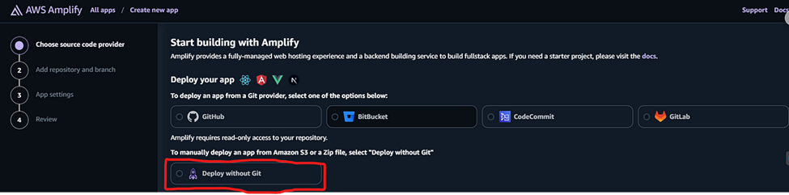
 
3. Select the S3 bucket, copy and paste the S3 bucket URL in the S3 location of objects to host and click on save and deploy.

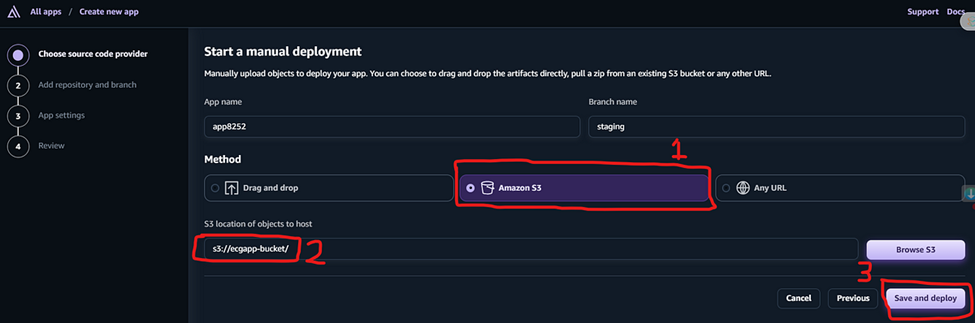
 
**Step 5: Create a User Pool with Amazon Cognito:**
1.	Go to Cognito and click Create User Pool.

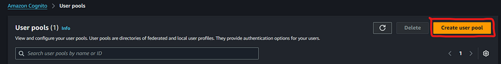
 
2. Configure sign-in with Email.

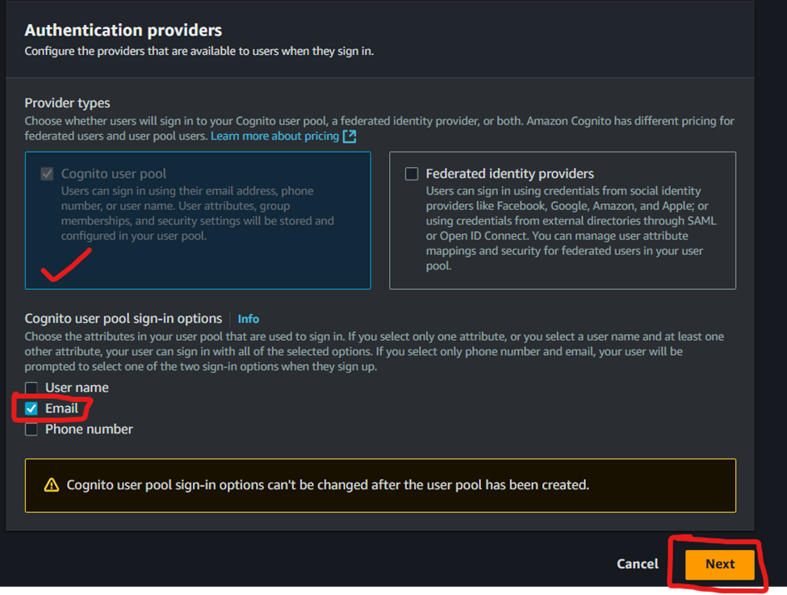
 
3. In the Configure security requirements select Cognito defaults. You can use the custom to set your password parameters or requirement base on your company password policies. 

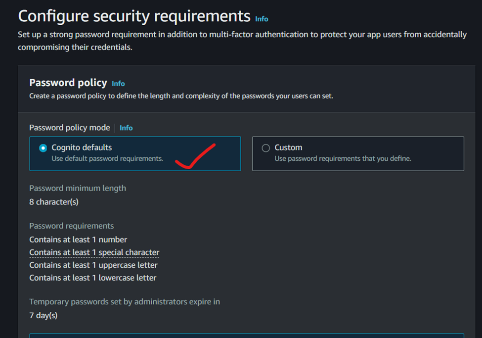
 
4. In the Multi-factor authentication select No MFA, tick the Enable self-service account recovery and email only. 
**NB: In the real work environment it is important to use MFA for additional security to your web app.**
 
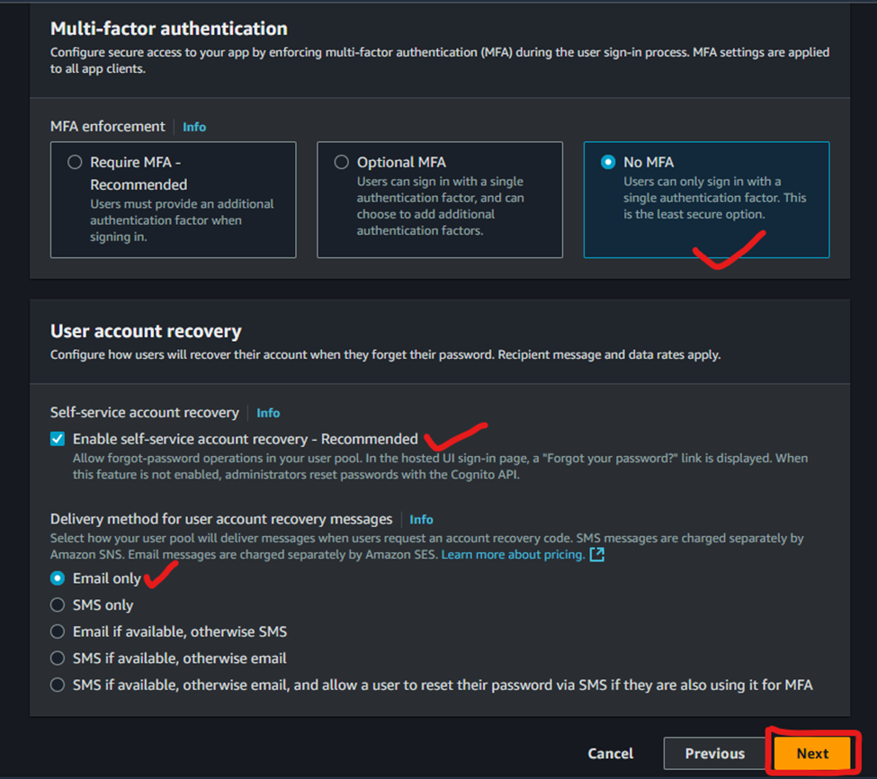

5. In the Configure sign-up experience enable self-registration.

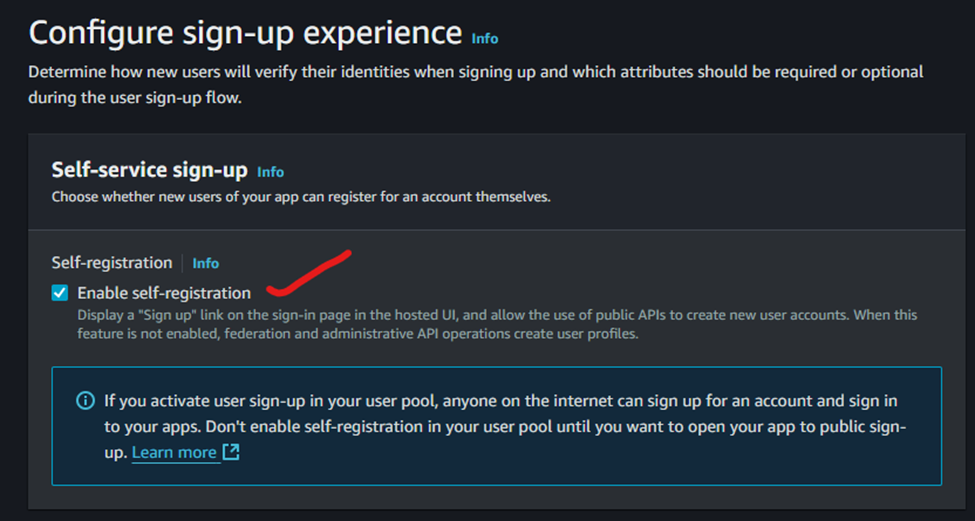
 
6. In the Cognito-assisted verification and confirmation perform the following settings as shown below. 

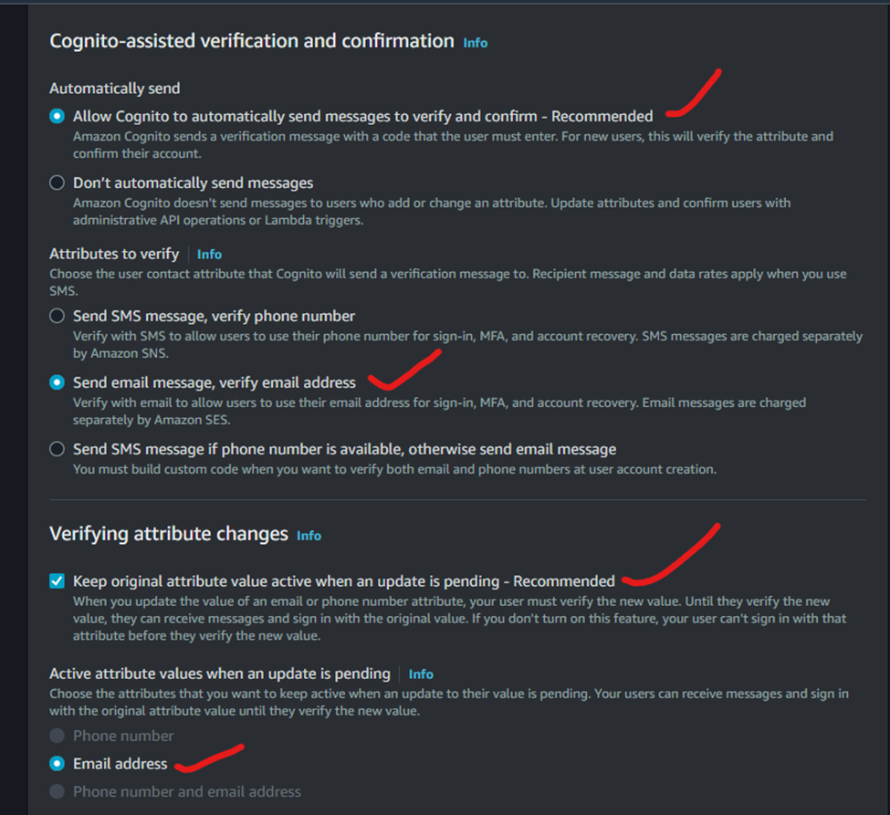
 
7. In the Required Attributes field select the required attribute which should be associated when a user creates an account and click on next. You can select as many attributes as you prefer based on your company's requirements. 

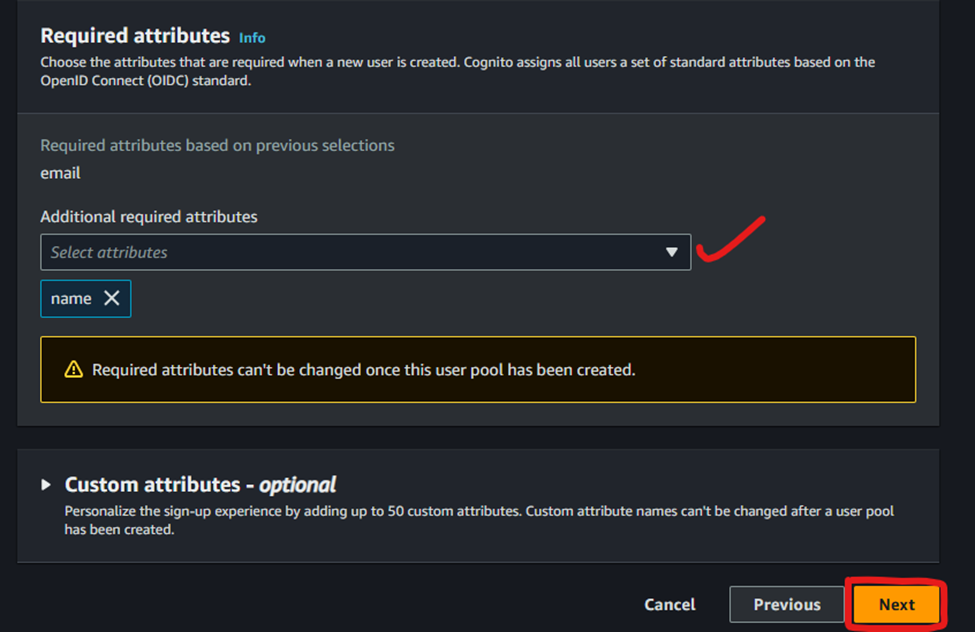
 
8. For message delivery, let Cognito handle it by selecting Send email with Cognito then click on Next.

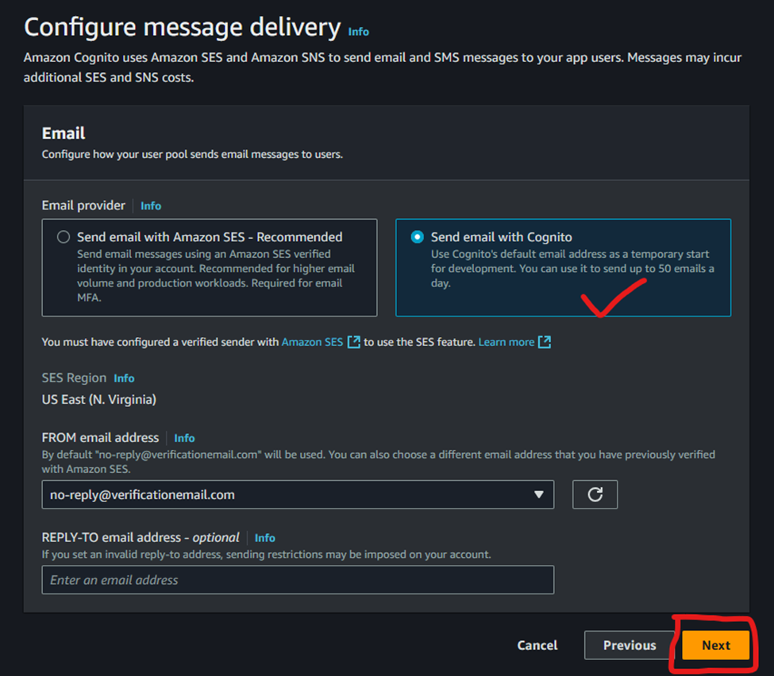
 
9. Choose a User Pool Name and Cognito domain for your hosted UI. Set a unique domain for the hosted UI (e.g. landingpage .auth.us-east-1.amazoncognito.com).

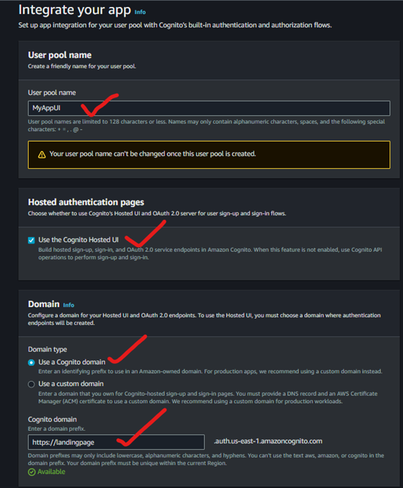
 
10. In the Initial app client, Configure the App type by selecting Public client, give your App client name, select Don’t generate a client secret and paste the Callback URL by using the URL of the deployed application slash the name of your app home page. (e.g.https://my-sample-app.amplifyapp.com/home.html). 

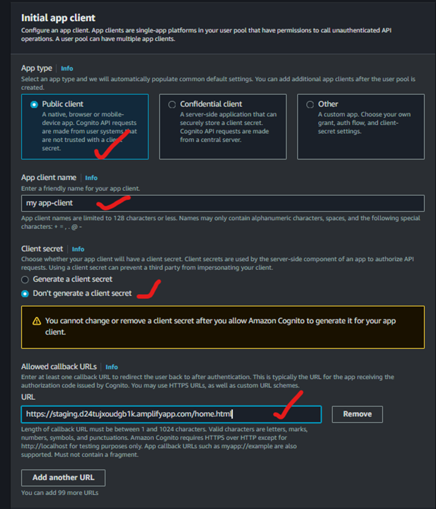
 
11. Review all the settings and click on Create User Pool. 

**Step 6: Set up the Cognito Authentication URL:**

1.	In your Cognito user pool, under App Integration, get the Client ID and domain.

2.	Build a link using the following format: https://your-cognito-domain.auth.us-east-1.amazoncognito.com/oauth2/authorize?response_type=code&client_id=your_client_id&redirect_uri=your_callback_url

3.	Replace your-cognito-domain, your_client_id, and your_callback_url with the values from your setup. 

**Step 7: Update HTML and Redeploy:**

1.	Use CloudShell to download, update, and re-upload your files. 

2.	Use this command to download your application file 
    
    aws s3 cp s3://your- bucket-name/app.zip

3.	Extract the file: 
    
    unzip app.zip

4.	Open the index.html file with **nano index.html** you can use "vim" instead of nano for the same purpose. 

5.	Replace the link for the sign-in button with your Cognitor URL. Save by using **CTRL + O and CTRL + X** to 
    close the editor. 

6.	Re-zip the modified files with this command: 
    
    zip -r app.zip

7.	Upload the modified file back to S3: 
    
    aws s3 cp app.zip s3://your-bucket-name/

8.	In Amplify, redeploy by selecting the updated .zip file.

**Step 8: Test Authentication:**

1.	Open the deployed web application from Amplify.

2.	Click Sign In, and select Sign Up to create a new user account.

3.	Complete the registration and verify with the code sent to your email.

4.	After verification, you should be redirected to the home page.

2. Verify your email to access the authenticated application.

**Conclusion**

You’ve successfully set up user authentication using AWS Cognito.

#AWS #Cognito #WebDevelopment #CloudSecurity #AmplifyDeployment

Written by: James Ackah-Blay 
Connect with me on LinkedIn Profile: https://www.linkedin.com/in/jamesackahblay/

