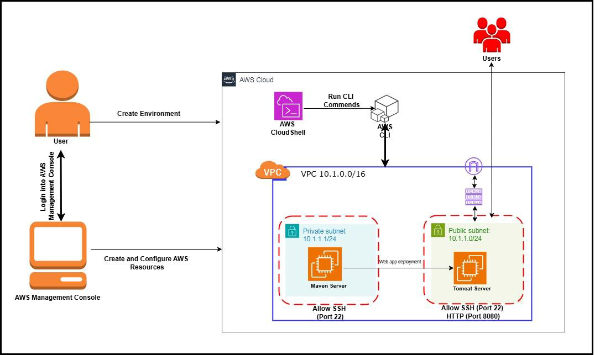
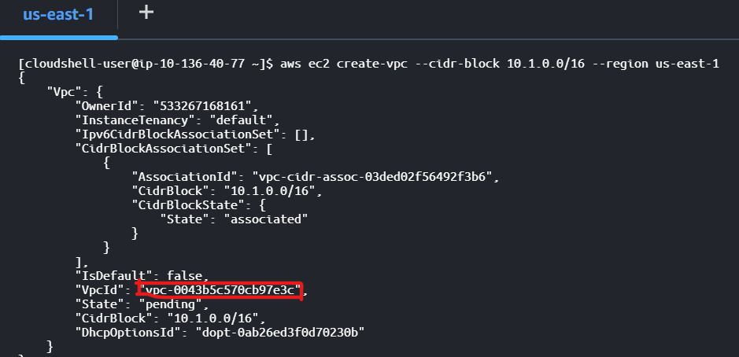
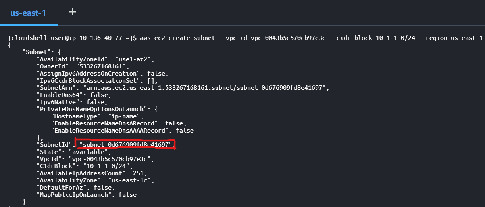
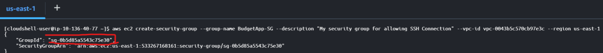
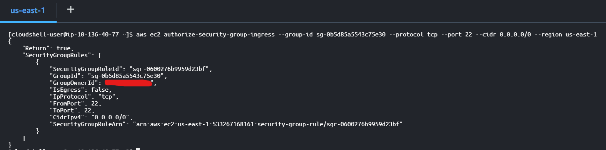
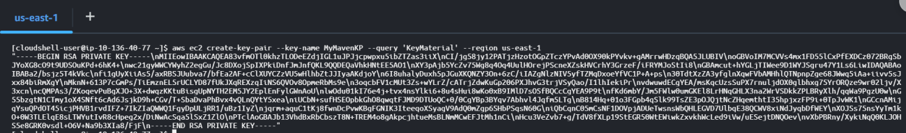
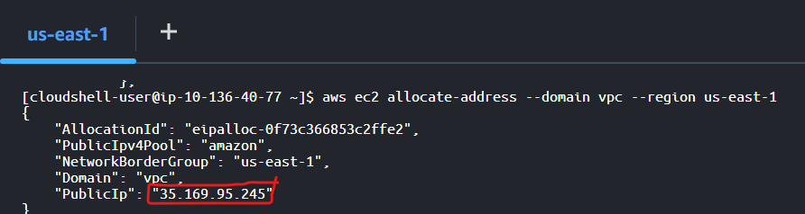
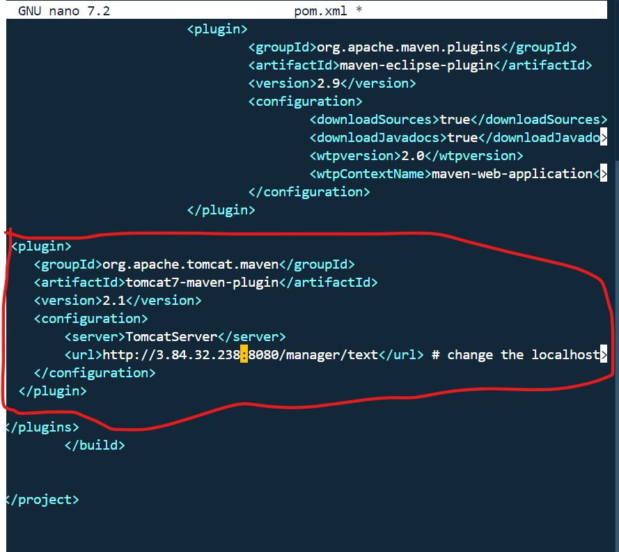

> **COMPREHENSIVE GUIDE TO DEPLOYING JAVA WEB APPLICATIONS ON [TOMCAT
> USING MAVEN AND AWS INFRASTRUCTURE]{.underline}**

{width="7.394444444444445in"
height="4.381944444444445in"}

> **[PROJECT OUTLINE]{.underline}**
>
> Part 1: Setting Up the Cloud Environment\
> Part 2: Creating AWS Resources Using AWS CLI\
> Part 3: Creating an EC2 Instance\
> Part 4: Building the Java Web App\
> Part 5: Setting Up the Tomcat Server\
> Part 6: Tomcat Configuration\
> Part 7: Deploying from Maven to Tomcat Using Plugin\
> Part 8: Deploying from Maven to Tomcat Using SCP Command

**PART 1: SETTING UP THE CLOUD ENVIRONMENT**

1\. Sign in to AWS Management Console\
- Go to the AWS website and log in to your account.

\- Set the region to \*\*US East (N. Virginia) or your preferred region.
2. Open the CloudShell in the AWS console to run AWS CLI commands

**PART 2: CREATING THE RESOURCES USING AWS CLI**\
1. **Create a VPC (Virtual Private Cloud)**\
- Open the CloudShell in the AWS Console to run AWS CLI commands.

> \- Run the command to create a VPC:\
> **aws ec2 create-vpc \--cidr-block 10.1.0.0/16 \--region us-east-1
> *Note: Save the VPC ID shown in the output. ***

{width="6.5in"
height="3.1416655730533685in"}

2\. **Create a Subnet**\
- Run the command to create a subnet within the VPC:\
**aws ec2 create-subnet \--vpc-id \<Your-VPC-ID\> \--cidr-block
10.1.1.0/24 \--region us-** **east-1**\
***Note: Save the Subnet ID.***

> {width="6.5in"
> height="2.7819444444444446in"}

3\. **Create an Internet Gateway**

> Run the command to create an Internet Gateway:
>
> **aws ec2 create-internet-gateway \--region us-east-1**

{width="6.5in"
height="1.8375in"}

> ***Note: Save the Internet Gateway ID***.

4\. **Attach the Internet Gateway to the VPC**

> **aws ec2 attach-internet-gateway \--vpc-id \<Your-VPC-ID\>
> \--internet-gateway-id**
>
> **\<Your-Internet-Gateway-ID\> \--region us-east-1**

5\. **Create a Route Table**

> **aws ec2 create-route-table \--vpc-id \<Your-VPC-ID\> \--region
> us-east-1**
>
> {width="6.5in"
> height="2.7569444444444446in"}
>
> ***Note: Save the Route Table ID.***

6\. **Create a Route for Internet Access**

> **aws ec2 create-route \--route-table-id \<Your-Route-Table-ID\>
> \--destination-cidr-block 0.0.0.0/0 \--gateway-id
> \<Your-Internet-Gateway-ID\> \--region us-east-1**
>
> {width="6.5in"
> height="0.7222222222222222in"}

7\. Associate the Subnet with the Route Table

> **aws ec2 associate-route-table \--subnet-id \<Your-Subnet-ID\>
> \--route-table-id \<Your-Route-Table-ID\> \--region us-east-1**
>
> {width="6.499998906386701in"
> height="0.9in"}

**PART 3: CREATING AN EC2 INSTANCE**

1\. **Create a Security Group**

> Run the command to create a security group:
>
> **aws ec2 create-security-group \--group-name \<Your Security Group
> Name\> \--description \"Description of SG\" \--vpc-id \<Your vpc id\>
> \--region us-east-1**
>
> {width="6.499998906386701in"
> height="0.5805555555555556in"}
>
> ***Note: Save the Security Group ID***.

2\. **Add Security Group Rules**

> Allow SSH (port 22) for connecting to the server:
>
> **aws ec2 authorize-security-group-ingress \--group-id \<Your Security
> Group id\> \--protocol tcp \--port 22 \--cidr 0.0.0.0/0 \--region
> us-east-1**
>
> ***NB: it is advisable to allow ssh from my ip in the working
> environment for security***
>
> ***best practices.***

{width="6.5in"
height="1.6138877952755906in"}

3\. **Create a Key Pair**

> **aws ec2 create-key-pair \--key-name \<Your Key Pair Name\> \--query
> \'KeyMaterial\' \--region us-east-1**

{width="6.5in"
height="0.9583333333333334in"}

> Copy the output into a text editor and save it with you key pair name.

4\. **Create an EC2 Instance**

> **aws ec2 run-instances \--image-id \<ami id\> \--count 1
> \--instance-type t2.micro \--key-name \<your key pair name\>
> \--security-group-ids \<Your Security Group id\> \--subnet-id \<subnet
> id\> \--region us-east-1**
>
> **Note: For EC2 instance image id check this**

{width="6.5in"
height="4.541666666666667in"}

> ***Note: Save the Instance ID.***

5\. **Allocate and Associate an Elastic IP**

> **aws ec2 allocate-address \--domain vpc \--region us-east-1**

{width="6.5in"
height="1.733332239720035in"}

6\. **Allocate an Elastic IP to the instance**.

> **aws ec2 associate-address \--instance-id i-07f62fa3f94ddb1bd
> \--allocation-id \<Your id here\> \--region us-east-1**

{width="6.5in"
height="0.6944444444444444in"}

**PART 3: BUILDING THE JAVA WEB APP**

1\. Connect to the Maven EC2 Instance Server\
- Use EC2 instance connect or SSH connect:\
**ssh -i MyCLIKP.pem ec2-user@\<Your-Elastic-IP\>**

2\. **Maven Installation Steps on Ubuntu:**

> \- Change the Hostname of The EC2 instance\
> **sudo hostnamectl set-hostname maven**
>
> **sudo su - ubuntu**

3\. **Update and Upgrade the Ubuntu EC2**

> **sudo apt update -y**
>
> **sudo apt upgrade -y**

4\. **Installation of Java and Git**

> **cd /opt**
>
> **sudo apt install default-jdk git -y**

5\. **Verify the Installation of Java and Git**

> **Java -version**\
> **git \--version**

6\. **Installing and Extracting Apache Maven**

> **sudo wget
> https://dlcdn.apache.org/maven/maven-3/3.9.6/binaries/apache-maven-3.9.6-bin.tar.gz**
>
> **sudo tar -xvzf apache-maven-3.9.6-bin.tar.gz**

{width="7.0in"
height="1.558332239720035in"}

7\. **Remove the Zip File and Rename the Extracted File sudo rm -rf
apache-maven-3.9.6-bin.tar.gz sudo mv apache-maven-3.9.6/ maven**

{width="7.0in"
height="1.8472222222222223in"}

8\. **Setting Up Environmental Variables for Maven** **sudo nano
\~/.bashrc**

> **copy the path below and paste it at the end of the script.**
>
> **export M2_HOME=/opt/maven**\
> **export PATH=\$PATH:\$M2_HOME/bin**

{width="7.0in"
height="3.0458333333333334in"}

9\. **Restart the .bashrc file**

> **source \~/.bashrc**

10\. **Check the Installation of Maven**

> **mvn -version**\
> ***NB: cd from the /opt directory after the Installation***

11\. **Make a directory named webapp-project and cd into it**\
**mkdir webapp-project**\
**cd webapp-project**\
***NB: the cloning must be done in the webapp-project directory you
created***

12\. **Git clone the project repo**

> **git clone**
>
> ***After cloning, you must change the directory (cd) into the web-app
> directory before you start executing any maven (mvn) commands or
> goal***

13\. You can start the following maven goals on your project: **- mvn
clean**\
**- mvn validate**\
**- mvn compile**\
**- mvn test**\
**- mvn package**

**PART 4: SETTING UP THE TOMCAT SERVER**\
1. Repeat PART 1 and 2 to set up the Tomcat Server

> **2. Installing Tomcat on the Tomcat Ubuntu Server** **sudo apt
> install update**\
> **sudo apt install upgrade**
>
> **3. Installing and Extracting Apache Tomcat**
>
> **sudo wget
> https://dlcdn.apache.org/tomcat/tomcat-9/v9.0.97/bin/apache-tomcat-9.0.97.tar.gz**\
> **sudo tar -xzvf apache-tomcat-9.0.97.tar.gz**
>
> **4. Remove the Zip File and Rename the Extracted File** **sudo rm -rf
> apache-tomcat-9.0.97.tar.gz**\
> **sudo mv apache-tomcat-9.0.97/ /opt/tomcat9**
>
> **5. Giving Executable Permission to Tomcat**
>
> **sudo chmod 777 -R /opt/tomcat9**
>
> **6. Creating Symbolic Links to Start and Stop Tomcat**\
> **sudo ln -s /opt/tomcat/tomcat9/bin/startup.sh /usr/bin/starttomcat**
>
> **sudo ln -s /opt/tomcat9/tomcat9/bin/shutdown.sh
> /usr/bin/stoptomcat**
>
> **7. Starting and Stopping Tomcat**\
> **sudo starttomcat**\
> **sudo stoptomcat**
>
> 8\. **To access the Tomcat server on the web browser**:
>
> *NB: You must add port 8080 to your security group inbound rules. Use
> the ip-address of your Tomcat server together with the default port
> number of Tomcat to access the homepage of the Tomcat server.* e.g
> http://ip-address:8080

**PART 5: TOMCAT CONFIGURATIONS:**\
1. To gain access to Tomcat\'s manager\'s page, you must edit the
context.xml file **- sudo nano
/opt/tomcat/webapps/manager/META-INF/context.xml** **- Locate these 2
lines and uncomment it as shown in the image.**

> **\<Valve className=\"org.apache.catalina.valves.RemoteAddrValve\"**
> **allow=\"127\\.\\d+\\.\\d+\\.\\d+\|::1\|0:0:0:0:0:0:0:1\" /\>**

{width="7.0in"
height="4.118055555555555in"}

**- Save and exit**\
2. **Tomcat Users Creation**:

> **- sudo nano /opt/tomcat9/conf/tomcat-users.xml**
>
> **\<user username=\"Your user name\" password=\"Your password\"
> roles=\"manager-**
>
> **gui, manager-script, admin-gui, manager-status\"/\>**
>
> **\<user username=\"Your user name\" password=\"Your password\"
> roles=\"manager-**

**script, manager-gui, admin-gui\"/\>**\
- Save and exit\
***NB: The first script can be linked to a root user in AWS and the
second one as an IAM***

***user with limited permissions. Click on this for more explanation
about the roles.***

**PART 6: DEPLOYING FROM MAVEN TO TOMCAT USING PLUGIN:** 1. On your
maven server, navigate to the .m2 directory\
**- cd \~/.m2**\
2. Create a settings.xml file\
**- sudo nano settings.xml**

3\. Paste this in the settings.xml\
**\<settings\>**\
**\<servers\>**\
**\<server\>**

> **\<id\>TomcatServer\</id\> *\# this id must match that of the
> \<server\> under the *** ***configuration in pom.xml***\
> **\<username\>tomcat username\</username\>**\
> **\<password\>tomcat password\</password\>**\
> **\</server\>**\
> **\</servers\>**\
> **\</settings\>**\
> - Save and exit

4\. Edit the pom.xml file\
**- nano pom.xml**

> **Note: Add this plugin**
>
> **\<plugin\>**\
> **\<groupId\>org.apache.tomcat.maven\</groupId\>**\
> **\<artifactId\>tomcat7-maven-plugin\</artifactId\>**\
> **\<version\>2.3\</version\>**\
> **\<configuration\>**\
> **\<server\>TomcatServer\</server\>**\
> **\<url\>http://localhost:8080/manager/text\</url\> #change the
> localhost to your ip** **\</configuration\>**\
> **\</plugin\>**\
> - Save and exit

{width="7.0in"
height="4.965277777777778in"}

5\. Now run this command to deploy from Maven to Tomcat: **- mvn
tomcat7:deploy**\
- To undeploy, run:\
**- mvn tomcat7:undeploy**

**PART 7: DEPLOYING FROM MAVEN TO TOMCAT USING SCP COMMAND:**

1\. Assign a password to the tomcat user (ubuntu) using this command

> \- **sudo passwd ubuntu**

2\. Enable password authentication

**- sudo nano /etc/ssh/sshd_config**\
3. Locate the PasswordAuthentication line and uncomment by deleting the
#tag **- PasswordAuthentication yes**

4\. Press CTRL + O to Save and CTRL + X to exit

> 5\. Restart the sshd service
>
> **- sudo systemctl restart sshd**
>
> 6\. On the maven server perform the following actions:
>
> ***NB: A connection needs to be established between the Maven server
> and the Tomcat server***.
>
> \- Copy the keypair of the tomcat server.
>
> \- create a .pem file on the maven server to save the tomcat keypair
>
> \- **sudo nano tomcatkeypair.pem**
>
> \- Paste the tomcat keypair copied earlier
>
> \- Use CTRL + O to save and CTRL + X to exit

7\. Give permission to the tomcatkeypair.pem

> **- chmod 400 tomcatkeypair.pem**

8\. SSH into the Tomcat server

> \- ssh -i tomcatkeypair.pem (ubuntu@ip-address)

9\. Now run this command to securely copy from Maven to Tomcat:

> **- scp -i keypair name /path/to/local/artifact.war**\
> **username@tomcat_server_ip:/path/to/tomcat/webapps/**
>
> **- scp -i tomcatkeypair.pem
> /home/ubuntu/webapp-project/web-app/target/web-app.war**
>
> **Conclusion**
>
> Deploying a web application on Tomcat using Maven in an AWS
> environment showcases a hands-on approach to DevOps practices by
> combining development tools, cloud infrastructure, and deployment
> strategies. This project is invaluable for modern enterprise
> environments, where scalable and reliable application hosting is
> crucial for business success.
>
> **NB: Looking forward to Junior DevOps internship opportunities.**
